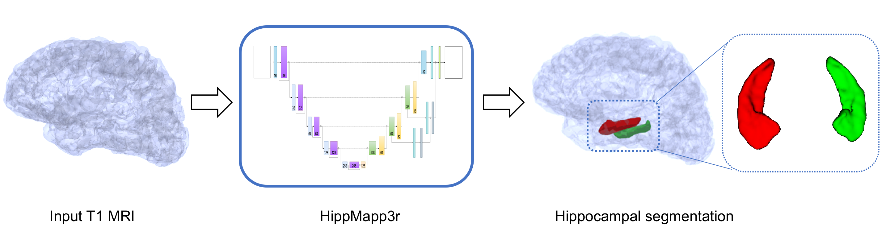

# iCVMapp3r

*iCVMapp3r* (pronounced icvmapper) is a CNN-based algorithm for brain extraction (skull-stripping)
using MRI images from BrainLab.
It can deal with brains with lesions and extensive atrophy and extracts the brain in seconds.
It can use a T1-weighted image or a combination of T1, T2 and Flair scans as input. 

      

____________________________

For more details, see our [docs](https://icvmapp3r.readthedocs.io).

Copyright (C) 2019 BrainLab.