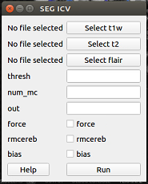
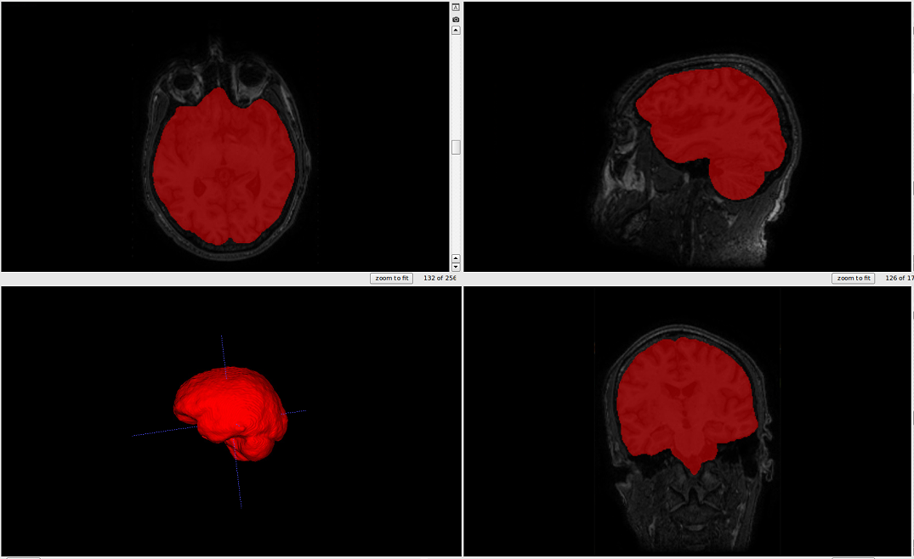

# Segmentation tutorials

## GUI

Watch this video tutorial:

-----

Or follow the steps below:

After opening the iCVMapper GUI, click "ICV" under the "Segmentation" tab. Wait for a new pop-up window to appear. The window should look like the image below.

Click "Select t1w" and choose your T1 image.
Click either of "Select t2w" and "Select flair" (with respect to the sequences you have) and select the correspending images.
Click "Run".
Type your desired output name in the "out" box.
If you want to overwrite the previous segmentation results, check the box beside "force"
Check off "rmcereb" if you want to generate a segmentation with a removed cerebellum, and "bias" if you want to bias field correct the sequences using N4 
Your output file will automatically appear in your t1w folder.

## Command Line

    icvmapper seg_icv
    
    Optional arguments:
    -h, --help           show this help message and exit
    -s , --subj          input subject
    -fl , --flair        input Flair
    -t1 , --t1w          input T1-weighted
    -t2 , --t2w          input T2-weighted
    -o , --out           output prediction
    -b, --bias           bias field correct image before segmentation
    -rc , --rmcereb      remove cerebellum
    -ign_ort, --ign_ort  ignore orientation if tag is wrong
    -f, --force          overwrite existing segmentation
    -n , --num_mc        number of Monte Carlo Dropout samples
    -th , --thresh       threshold
    -ss , --session      input session for longitudinal studies
    
    Examples:
    icvmapper seg_icv -s subjectname -b
    icvmapper seg_icv -t1 subject_T1_nu.nii.gz -o subject_icv.nii.gz

The output should look like this.:

