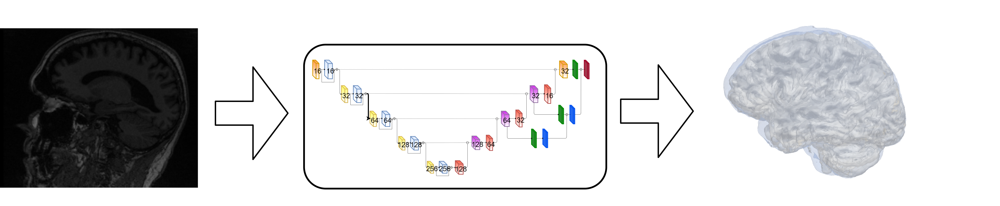

.. iCVMapp3r documentation master file, created by
   sphinx-quickstart on Fri Dec 14 15:34:18 2018.
   You can adapt this file completely to your liking, but it should at least
   contain the root `toctree` directive.

Welcome to iCVMapp3r's documentation!
==================================

*iCVMapp3r* (pronounced icvmapper) is a CNN-based segmentation technique of the intracranial volume (ICV)
using MRI images from BrainLab.
It can deal with brains with extensive atrophy and segments the ICV in seconds.
It can segment the ICV with either T1-weighted image as the only input, or with different combinations involving a T1, T2, and FLAIR image.

.. toctree::
   :maxdepth: 2
   :caption: Contents:

   before_install
   install
   beginner
   icv_seg
   issues
   docker

Indices and tables
====================

* :ref:`genindex`
* :ref:`modindex`
* :ref:`search`
